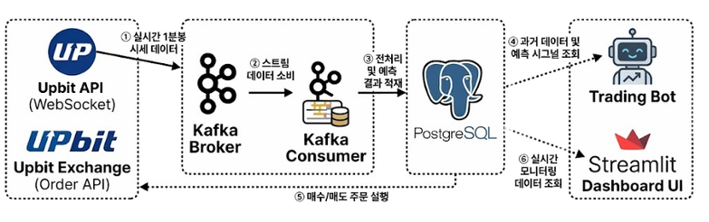
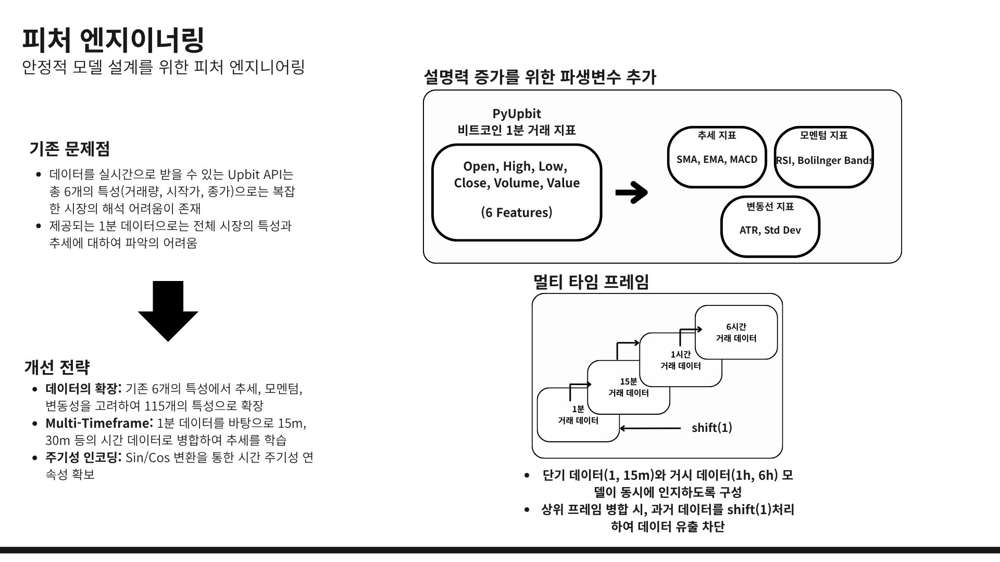
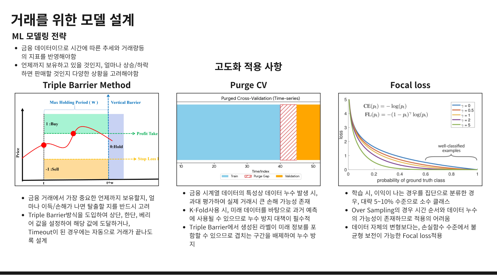
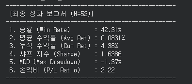
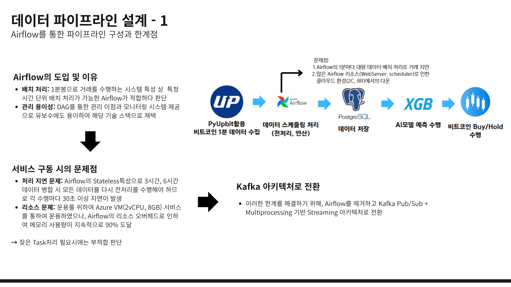
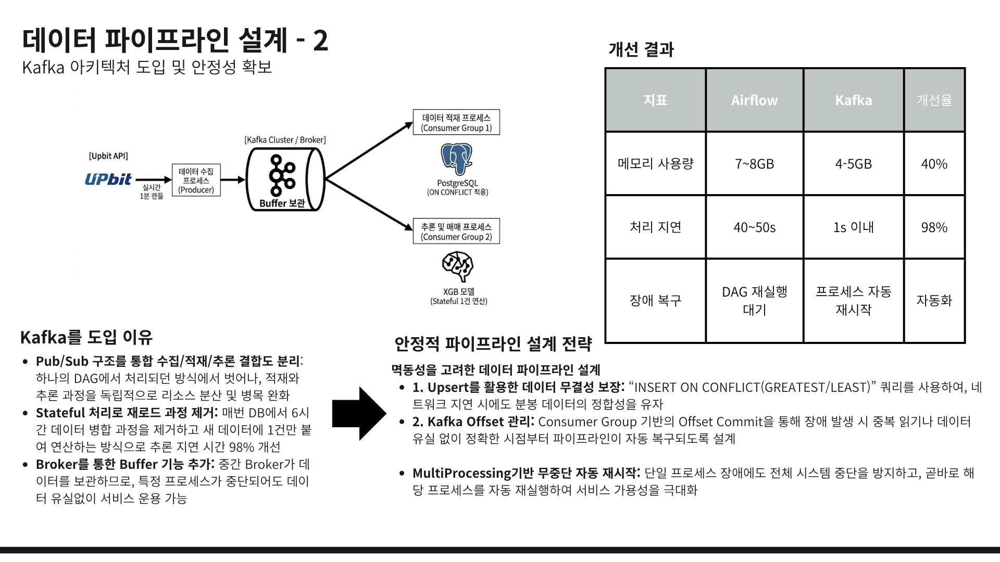
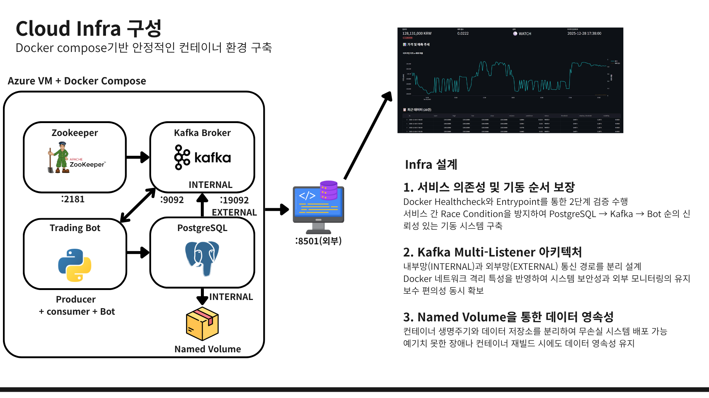
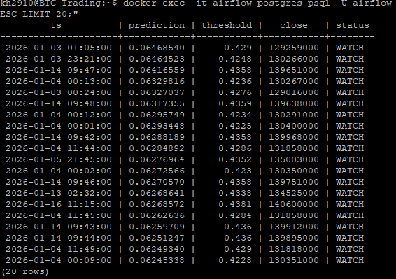

# 💰 Real-time BTC Trading Pipeline (Kafka & Multiprocessing)
> 개인 Toy 프로젝트
> 업비트 API 기반 실시간 비트코인 단기 트레이딩 시스템  
> 데이터 수집 → 스트리밍 처리 → AI 추론 → 자동 매매까지 엔드투엔드 파이프라인

[](https://www.python.org/)
[](https://kafka.apache.org/)
[](https://www.postgresql.org/)
[](https://www.docker.com/)
[](https://xgboost.readthedocs.io/)

---

## 📌 프로젝트 개요 (Project Overview)

알고리즘 기반 암호화폐 트레이딩 봇이 실제 수익을 창출하는 비즈니스 모델로 자리 잡고 있는 트렌드에서 착안하여,  
**KRW-BTC(비트코인)** 거래쌍을 대상으로 실시간 단기 트레이딩 시스템을 구축한 프로젝트입니다.

### 🎯 데이터 엔지니어링 역량 강조 포인트

| 영역 | 핵심 내용 |
|------|-----------| 
| **아키텍처 전환** | 리소스 제약 환경에서 Airflow 배치 구조를 **Kafka 기반 실시간 스트리밍 구조**로 최적화 |
| **시스템 안정성** | Python `multiprocessing`을 활용한 마이크로서비스 오케스트레이션 및 **결합도 분리** |
| **데이터 무결성** | 실시간 1분봉 데이터의 **유실 없는 적재** 및 다중 타임프레임 지표 연산 |

---

## 🏗️ 1. System Architecture

업비트 API로부터 발생하는 실시간 시세 데이터를 안정적으로 **수집 → 가공 → 저장**하고,  
이를 기반으로 AI 모델이 추론을 수행할 수 있도록 **엔드투엔드 파이프라인**을 구축했습니다.

### 아키텍처 다이어그램

<p align="center">
  
</p>

### 📋 Component Description

> 아키텍처 다이어그램의 각 컴포넌트와 실제 소스 코드의 매핑입니다.

| 다이어그램 컴포넌트 | 역할 | 관련 파일 |
|:---:|:---|:---|
| **Upbit API (WebSocket)** | 실시간 1분봉 시세 데이터의 원천 소스 | — (외부 API) |
| **Kafka Producer** | 웹소켓으로 수신한 시세 데이터를 Kafka Topic으로 발행 | `producer_btc_1m_kafka.py` |
| **Kafka Broker** | Producer와 Consumer 간 메시지 중개 (Pub/Sub) | Docker Compose 내 서비스 |
| **Kafka Consumer** | 스트리밍 데이터를 구독하여 PostgreSQL에 실시간 적재 | `kafka_to_postgres.py` |
| **PostgreSQL** | 시세 데이터, 예측 결과, 거래 이력 저장소 | `apply_db_schema.py` |
| **Trading Bot** | Kafka 메시지 + DB 과거 데이터를 결합하여 XGBoost 모델로 매매 결정 | `realtime_bot.py` |
| **Streamlit Dashboard UI** | 파이프라인 상태, PnL, 승률 등 실시간 모니터링 | `dashboard.py` |
| **Orchestrator** *(다이어그램 외)* | 모든 프로세스의 생명 주기 관리, 헬스체크 및 자동 재시작 | `main.py` |

### 🔹 데이터 흐름 (Data Flow)

| 흐름 번호 | 단계 | 설명 |
|:---:|:---|:---|
| **①** | **Ingestion** | 업비트 웹소켓 → Kafka Producer → Kafka Broker로 실시간 1분봉 데이터 발행 |
| **②③** | **Storage** | Kafka Consumer가 스트리밍 데이터를 구독하여 전처리 후 PostgreSQL에 적재 |
| **④** | **Inference** | Trading Bot이 DB의 과거 데이터 및 예측 시그널을 조회하여 다중 타임프레임 지표 생성 → XGBoost 모델로 매매 결정 |
| **⑤** | **Execution** | 매수/매도 주문을 Upbit Exchange Order API로 실행 |
| **⑥** | **Monitoring** | Streamlit 대시보드가 DB를 조회하여 파이프라인 상태 및 수익률 시각화 |

---

## 🧪 2. 피처 엔지니어링 (Feature Engineering)

Upbit API가 제공하는 원시 1분봉 데이터(OHLCV 6개 피처)만으로는 복잡한 시장의 추세와 변동성을 파악하기 어렵습니다.
이를 극복하기 위해 추세, 모멘텀, 변동성 지표를 파생하고, 다중 타임프레임 병합과 시간 주기성 인코딩을 적용하여 **총 115개의 피처**를 자동 생성하는 파이프라인을 구축했습니다.

<p align="center">
  
</p>

---

## 🧠 3. 거래를 위한 모델 설계 (ML Modeling Strategy)

금융 데이터의 시계열 특성상 일반적인 ML 학습 파이프라인을 그대로 적용하면 과대 평가와 데이터 누수 문제가 발생합니다.
이를 방지하기 위해 **Triple Barrier Method**로 실전 트레이딩 조건을 반영한 라벨링을 수행하고, **Purged Cross-Validation**으로 시간순 누수를 차단하며, **Focal Loss**로 불균형 클래스 문제에 대응했습니다.

<p align="center">
  
</p>

### 📊 백테스트 결과 (2024.11 ~ 2025.09 데이터 기준)

위의 모델링 전략을 적용한 XGBoost 모델에 대해 2024년 11월부터 2025년 9월까지의 데이터를 기반으로 백테스트를 수행한 결과입니다.

<p align="center">
  
</p>

| 지표 | 수치 |
|:---:|:---:|
| **총 거래 횟수** | 52회 |
| **승률 (Win Rate)** | 42.31% |
| **평균 수익률 (Avg Return)** | 0.0831% |
| **누적 수익률 (Cumulative Return)** | 4.38% |
| **샤프 지수 (Sharpe Ratio)** | 1.6386 |
| **최대 낙폭 (MDD)** | -1.37% |
| **손익비 (P/L Ratio)** | 2.22 |

승률은 42%로 높지 않지만, **손익비 2.22**(이익 거래의 평균 수익이 손실 거래의 약 2.2배)를 통해 소수의 수익 거래가 다수의 손실을 커버하는 전략임을 확인할 수 있습니다. 최대 낙폭(MDD)이 -1.37%로 제한적이며, 샤프 지수 1.64는 리스크 대비 합리적인 수익을 달성했음을 나타냅니다.

---

## 🛠️ 4. 데이터 파이프라인 설계

### 4-1. Airflow 기반 초기 구조와 한계

초기에는 시간 단위 배치 처리에 적합한 Apache Airflow를 도입하여 1분 단위 ETL 파이프라인을 구축했습니다.
그러나 Airflow의 Stateless 특성으로 매 실행마다 전체 과거 데이터를 재조회해야 하는 비효율성과, Scheduler·Webserver 등의 상시 구동 프로세스로 인해 Azure VM(2vCPU, 8GB) 환경에서 메모리 사용량이 지속적으로 90%를 초과하는 한계가 드러났습니다.

<p align="center">
  
</p>

### 4-2. Kafka 아키텍처 전환 및 안정성 확보

Airflow의 한계를 해결하기 위해 Kafka Pub/Sub + Python Multiprocessing 기반의 스트리밍 아키텍처로 전환했습니다.
Pub/Sub 구조를 통해 수집/적재/추론 프로세스의 결합도를 분리하고, Stateful 처리로 재로드 과정을 제거하여 처리 지연 시간을 98% 개선했습니다. 또한 Upsert 전략, Kafka Offset 관리, 프로세스 자동 재시작을 통해 멱등성을 고려한 안정적 데이터 파이프라인을 설계했습니다.

<p align="center">
  
</p>

---

## ☁️ 5. Cloud Infra 구성

Docker Compose 기반으로 Zookeeper, Kafka Broker, PostgreSQL, Trading Bot, Streamlit Dashboard를 단일 Azure VM 위에서 안정적으로 운영하는 컨테이너 환경을 구축했습니다.
서비스 간 Race Condition을 방지하는 2단계 기동 순서 보장, 내부/외부 네트워크를 분리하는 Kafka Multi-Listener 구성, Named Volume을 활용한 데이터 영속성 확보 등 운영 안정성에 중점을 둔 인프라 설계입니다.

<p align="center">
  
</p>

---

## 📈 6. Project Impact

| 지표 | 성과 |
|------|------|
| **Latency** | 데이터 수집부터 모델 추론까지 지연 시간 **< 1초** |
| **Reliability** | 72시간 연속 가동 테스트 시 **데이터 유실 0%** 달성 |
| **Optimization** | 경량화된 아키텍처를 통해 **저사양 인스턴스**(2GB RAM)에서도 안정적 서빙 가능 |
| **Backtest** | 누적 수익률 **4.38%**, 손익비 **2.22**, 최대 낙폭 **-1.37%** |

---

## 🔍 7. 프로젝트 회고 (Retrospective)

### 회고 1: 모델 경직성 — 약세장에서의 예측값 정체 현상

모델을 실제 클라우드 환경에 배포하고 운영한 결과, 약세장 환경에서 모델 예측값이 **0.03~0.10 구간에 정체**되어 동적 임계값(0.40~0.55)을 넘지 못하고 거래가 거의 발생하지 않는 **모델 경직성** 문제를 확인했습니다.

<p align="center">
  
</p>

위 실거래 DB 조회 결과에서 볼 수 있듯이, prediction 값이 0.06 내외에 고착되어 있으며 모든 데이터의 status가 `WATCH`(관망) 상태를 유지하고 있습니다. 이는 모델이 특정 시장 국면(학습 데이터 구간)에 과적합되어, 이후 약세장 환경에서는 매수 시그널을 생성하지 못하는 구조적 한계를 보여줍니다.

**핵심 교훈:**
- 단일 기간 데이터로 학습한 모델은 시장 국면이 바뀌면 예측력이 급격히 저하됨을 체감
- 시장 환경 변화(Data Drift)에 대응하기 위한 **주기적 재학습 파이프라인**의 필요성 인지
- 강세/약세/횡보 등 시장 국면에 따른 **전략 분화**(예: 국면별 별도 모델 또는 앙상블)가 실전 트레이딩에서는 필수적이라는 결론 도출

### 회고 2: 인프라 확장성 — 단일 VM 아키텍처의 한계

현재 시스템은 단일 Azure VM 위에 Docker Compose로 모든 서비스를 운영하는 구조입니다. 현 시점에서는 단일 종목(BTC)의 1분봉 데이터를 처리하는 데 충분하지만, 서비스가 확장되거나 처리량이 증가하는 경우에는 서버 리소스 문제가 빠르게 발생할 수 있다고 판단합니다.

**구체적으로 예상되는 한계:**
- 멀티 종목(ETH, XRP 등) 확장 시 Producer/Consumer 프로세스 증가로 인한 메모리 부족
- 실시간 트래픽 급증(시장 급변동 시) 상황에서 단일 Kafka Broker의 처리량 한계
- 수평 확장(Scale-Out)이 불가능한 Docker Compose 단일 호스트 구조

**향후 고도화 방향:**
- **Kubernetes(AKS) 도입**을 통해 각 컴포넌트를 독립 Pod으로 분리하고, HPA(Horizontal Pod Autoscaler)를 적용하여 부하에 따른 동적 스케일링 구현
- 현재 시스템이 이미 Producer/Consumer/Bot을 독립 프로세스로 분리한 구조이기 때문에, **Pod 단위 전환이 용이**한 설계상의 이점이 있음
- Prometheus + Grafana 기반의 메트릭 수집 및 알림 자동화를 통해 운영 가시성 확보

---

## 🛠️ 8. Tech Stack

| Category | Technologies |
|----------|-------------|
| **Language** | Python 3.10+ |
| **Streaming** | Apache Kafka, Confluent Kafka |
| **Database** | PostgreSQL (SQLAlchemy) |
| **ML Model** | XGBoost (scikit-learn) |
| **Infrastructure** | Docker, Docker Compose, Azure VM |
| **Visualization** | Streamlit |

---

## 🚀 9. 실행 방법 (How to Run)

### Step 1. 보안 키 설정
소스코드 내부 변수 `UPBIT_ACCESS_KEY`, `UPBIT_SECRET_KEY`를 설정하거나 별도의 환경 변수 주입 방식에 본인의 업비트 API Key를 입력합니다.

> ⚠️ **주의**: API Key는 절대 Github에 업로드하지 마세요.

### Step 2. Docker 빌드 및 실행
`docker-compose.yml`을 통해 모든 환경(PostgreSQL, Zookeeper, Kafka, Trading Bot, Dashboard)이 구축됩니다.

```bash
# 백그라운드에서 모든 서비스 실행
docker-compose up -d --build
```

### Step 3. 주요 서비스 확인

```bash
# 트레이딩 시스템 로그 확인
docker logs -f trading-bot
```

웹 브라우저에서 `http://localhost:8501`로 접속하여 대시보드를 통해 현재 시스템 상태 및 예상 수익을 모니터링할 수 있습니다.

---

## 📁 10. 프로젝트 구조 (Project Structure)

```
BTC_for_cloud/
├── main.py                      # 🎛️ 멀티프로세싱 오케스트레이터
├── producer_btc_1m_kafka.py     # 📡 Kafka Producer (1분봉 데이터 수집)
├── kafka_to_postgres.py         # 📥 Kafka Consumer → PostgreSQL 적재
├── realtime_bot.py              # 🤖 실시간 트레이딩 봇 (추론 + 매매)
├── indicators.py                # 📊 보조지표 연산 모듈
├── dashboard.py                 # 📈 Streamlit 대시보드
├── xgb_final_model.joblib       # 🧠 학습된 XGBoost 모델
├── docker-compose.yml           # 🐳 Docker Compose 설정
├── Dockerfile                   # 🐳 컨테이너 빌드 설정
├── entrypoint.sh                # 🚀 컨테이너 엔트리포인트
├── data_preprocess/             # 📓 데이터 전처리 및 모델 학습 노트북
│   └── experiments/             # 🧪 실험 및 백테스팅 기록
└── dags/                        # ⚠️ (Deprecated) Airflow DAG 코드
```

---

<p align="center">
  <sub>Built with ❤️ for Data Engineering & ML Pipeline Architecture</sub>
</p>�세 지표(이동평균선, MACD, RSI, 볼린저 밴드 등)를 결합하여 노이즈에 강한 데이터셋을 구축합니다.

---

## 🛠️ 5. Tech Stack

| Category | Technologies |
|----------|-------------|
| **Language** | Python 3.10+ |
| **Streaming** | Apache Kafka, Confluent Kafka |
| **Database** | PostgreSQL (SQLAlchemy) |
| **ML Model** | XGBoost (scikit-learn) |
| **Infrastructure** | Docker, Docker Compose, Azure (Container Apps) |
| **Visualization** | Streamlit |

---

## 🚀 6. 실행 방법 (How to Run)

### Step 1. 보안 키 설정
소스코드 내부 변수 `UPBIT_ACCESS_KEY`, `UPBIT_SECRET_KEY`를 설정하거나 별도의 환경 변수 주입 방식에 본인의 업비트 API Key를 입력합니다.

> ⚠️ **주의**: API Key는 절대 Github에 업로드하지 마세요.

### Step 2. Docker 빌드 및 실행
`docker-compose.yml`을 통해 모든 환경(PostgreSQL, Zookeeper, Kafka, Trading Bot, Dashboard)이 구축됩니다.

```bash
# 백그라운드에서 모든 서비스 실행
docker-compose up -d --build
```

### Step 3. 주요 서비스 확인

```bash
# 트레이딩 시스템 로그 확인
docker logs -f trading-bot
```

웹 브라우저에서 `http://localhost:8501`로 접속하여 대시보드를 통해 현재 시스템 상태 및 예상 수익을 모니터링할 수 있습니다.

---

## 📁 7. 프로젝트 구조 (Project Structure)

```
BTC_for_cloud/
├── main.py                      # 🎛️ 멀티프로세싱 오케스트레이터
├── producer_btc_1m_kafka.py     # 📡 Kafka Producer (1분봉 데이터 수집)
├── kafka_to_postgres.py         # 📥 Kafka Consumer → PostgreSQL 적재
├── realtime_bot.py              # 🤖 실시간 트레이딩 봇 (추론 + 매매)
├── indicators.py                # 📊 보조지표 연산 모듈
├── dashboard.py                 # 📈 Streamlit 대시보드
├── xgb_final_model.joblib       # 🧠 학습된 XGBoost 모델
├── docker-compose.yml           # 🐳 Docker Compose 설정
├── Dockerfile                   # 🐳 컨테이너 빌드 설정
├── entrypoint.sh                # 🚀 컨테이너 엔트리포인트
├── data_preprocess/             # 📓 데이터 전처리 및 모델 학습 노트북
│   └── experiments/             # 🧪 실험 및 백테스팅 기록
└── dags/                        # ⚠️ (Deprecated) Airflow DAG 코드
```

---

<p align="center">
  <sub>Built with ❤️ for Data Engineering & ML Pipeline Architecture</sub>
</p>
