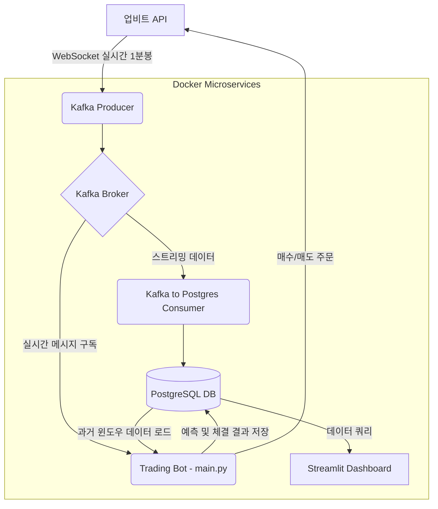

# 💰 실시간 비트코인 단기 트레이딩 봇 (BTC Trading Bot)

## 📌 프로젝트 개요 및 동기 (Project Overview & Motivation)
최근 알고리즘 기반의 암호화폐 트레이딩 봇이 실제 수익을 창출하는 비즈니스 모델로 자리 잡고 있는 트렌드에서 착안하여 시작한 프로젝트입니다. 안정적인 데이터 수집, 풍부한 유동성, 그리고 머신러닝 모델이 패턴을 인식하기에 적합한 뚜렷한 추세 형성을 보여주는 **KRW-BTC(비트코인)** 거래쌍을 대상으로 단기 트레이딩 봇을 개발하였습니다.

이 시스템은 실시간 데이터 수집부터 전처리, AI 기반 추론, 의사결정 및 매매 체결까지의 전 과정을 클라우드 환경에서 Docker 환경 하에 독립적이고 안정적으로 동작하도록 설계되었습니다.

---

## 🏗️ 시스템 아키텍처 및 실행 흐름 (System Architecture)

본 프로젝트는 Docker Compose를 활용하여 각각의 독립된 컨테이너가 역할을 수행하며 유기적으로 동작합니다.



### 🔹 데이터 및 실행 흐름
1. **Producer (`producer_btc_1m_kafka.py`)**: 업비트 웹소켓을 통해 실시간 BTC 1분봉 데이터를 수집하고 Kafka Topic(`btc-1m-candle`)으로 전송합니다.
2. **Consumer - DB 저장 (`kafka_to_postgres.py`)**: Kafka에서 받은 데이터를 안전하게 PostgreSQL 데이터베이스에 적재합니다.
3. **Trading Bot (`realtime_bot.py`)**: 
   - Kafka로부터 실시간 시세 데이터를 구독하면서 내부 윈도우(DataFrame)를 업데이트합니다.
   - DB에 적재된 데이터를 로드하여 다중 타임프레임 전환(15m, 30m, 1h 등) 및 보조지표를 실시간으로 연산합니다.
   - 사전에 훈련된 XGBoost 모델(`xgb_final_model.joblib`)를 통해 상승 확률을 예측하고, 동적 임계값 로직에 따라 매매(Buy/Sell) 결정을 내립니다.
   - 주문 결과와 예측 확률을 다시 DB에 저장(Upsert)합니다.
4. **Dashboard (`dashboard.py`)**: Streamlit으로 구현되어 컨테이너 외부 서버에서 DB에 접근해 현재 봇의 상태(PnL, 승률, 포지션)를 시각화합니다.
5. **Orchestrator (`main.py`)**: 파이썬 멀티프로세싱 모듈을 사용해 `Producer`, `DB Consumer`, `Trading Bot` 세 개의 프로세스를 관리하고 헬스체크 및 재시작 처리를 수행합니다.

### 💡 아키텍처 개선 (Airflow ➡️ Multiprocessing)
초기 시스템 설계 시 파이프라인 관리를 위해 **Apache Airflow**를 도입하였으나, 실운영 과정에서 다음과 같은 한계점을 확인하고 현재의 Python `multiprocessing` 기반 경량화 구조로 개선하였습니다.
- **오버헤드 문제**: 2GB, 8RAM의 제한된 클라우드 환경에서 Airflow의 스케줄러와 웹 서버가 차지하는 리소스 오버헤드로 인해 OOM(Out of Memory) 현상 및 프로세스 멈춤이 빈번하게 발생했습니다.
- **실시간성 제약**: Airflow는 본래 배치(Batch) 처리에 특화된 도구이므로, 1분 단위의 초단타 실시간 메시지 스트리밍을 처리하기에는 지연(Latency)이 발생하고 적합하지 않다고 판단했습니다.
- **결과**: `main.py` 기반의 멀티프로세싱 오케스트레이션으로 전환한 후, 리소스 사용량을 대폭 절감하고 1분봉 데이터의 유실 없는 실시간 처리가 가능해졌습니다.

---

## 🧠 핵심 컴포넌트 및 로직 분석 (Key Technologies)

이 트레이딩 모델은 단순한 가격 지표를 넘어 다음과 같은 복합적 데이터를 피처(Feature)로 활용합니다.

1. **다중 타임프레임 병합 (Multi-Timeframe Integration)**: `merge_higher_tf` 함수를 통해 1분봉 데이터에 15분, 30분, 1시간, 4시간, 6시간 수준의 거시적 추세 지표(이동평균선, MACD, RSI, 볼린저 밴드 등)를 결합하여 노이즈에 강한 데이터셋을 구축합니다.
2. **분수 차분 (Fractional Differencing)**: 시계열 데이터의 정상성(Stationarity)을 확보하면서도 패턴의 메모리를 보존하기 위해 $d=0.4$ 수준의 분수 차분을 적용하여 모델의 예측력을 높입니다.
3. **트리플 배리어 기법 (Triple Barrier Method)**: `check_exit_conditions` 함수를 통하여 단순 보유 시간이 아닌, **목표가(Take Profit)**, **손절가(Stop Loss)**, **시간 제한(Time Limit)** 세 개의 장벽을 두고 포지션을 능동적으로 청산 관리합니다.
4. **동적 임계값 (Dynamic Thresholding)**: 시장의 변동성에 따라 매수 확률 컷오프(0.40 ~ 0.55 범위)를 동적으로 조절하여, 횡보장과 급등락장을 구분하여 안전하게 진입합니다.
5. **섀도우 모드 (Shadow Trading)**: 실제 자산이 투입되지 않더라도 예측 결과(`Shadow_threshold`)를 로깅(`shadow_trades.csv`)하여 향후 전략의 백테스트나 한계점을 검증할 수 있는 기능을 내장하고 있습니다.

---

## 🚀 실행 방법 (How to Run)

### 1. 보안 키 설정
소스코드 내부 변수 `UPBIT_ACCESS_KEY`, `UPBIT_SECRET_KEY`를 설정하거나 별도의 환경 변수 주입 방식에 본인의 업비트 API Key를 입력합니다. (주의: 절대 Github에 업로드하지 마세요)

### 2. Docker 빌드 및 실행
`.env` 파일이 필요 없이 `docker-compose.yml`을 통해 모든 환경(PostgreSQL, Zookeeper, Kafka, Trading Bot, Dashboard)이 구축됩니다.

```bash
# 백그라운드에서 모든 서비스 실행
docker-compose up -d --build
```

### 3. 주요 서비스 확인
- **트레이딩 시스템 로그 확인**:
    ```bash
    docker logs -f trading-bot
    ```
- **대시보드 접속**:
    웹 브라우저에서 `http://localhost:8501`로 접속하여 현재 시스템 상태 및 예상 수익을 모니터링할 수 있습니다.

---

## 📁 기타 폴더 구조 설명
- **`data_preprocess/01_final_data_and_model.ipynb`**: BTC의 데이터를 수집하여 최종 XGBoost 모델을 도출해낸 일련의 유요한 전처리 및 훈련 코드가 담겨 있습니다.
- **`data_preprocess/experiments/`**: 이전의 실험 및 백테스팅 기록, 다양한 모델들을 테스트했던 과정 코드들이 보존되어 있습니다.
- **`dags/`**: (Deprecated) 초기 단계에서 파이프라인으로 사용했던 Apache Airflow의 DAG 코드가 남아있습니다. 현재 운영 환경에서는 리소스 절감을 위해 멀티프로세싱으로 대체되어 더 이상 사용되지 않습니다.

